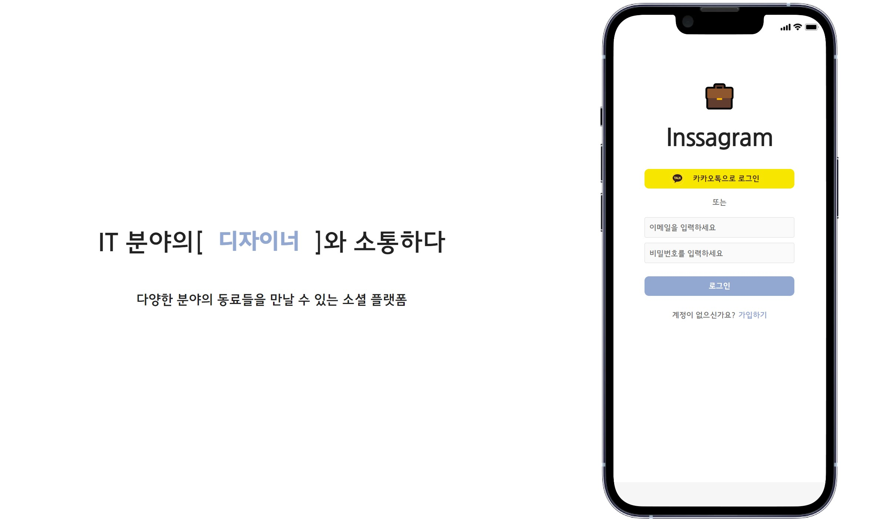
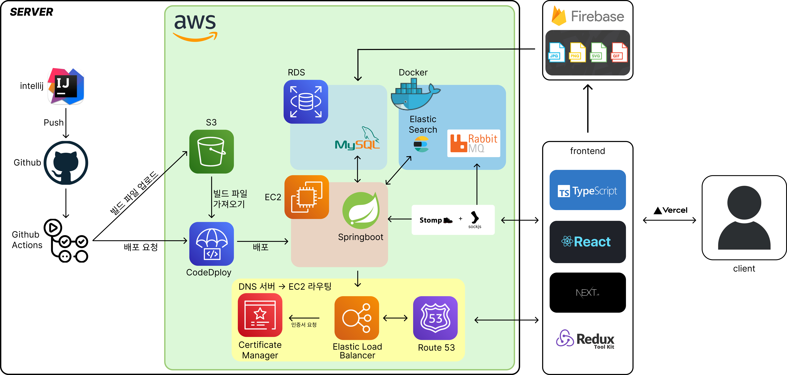

# Inssagram(인싸그램)

## 💻 Project
Inssagram은 다양한 분야의 동료들을 만날 수 있는 소셜 플랫폼 입니다.

 

## ⏰ Development Period

1차 23.10 - 23.12
2차 23.12 - 24.02(개인적으로 진행)

 

## ⌨️ Tech Stack

#### 프론트엔드
  
  
![Redux] ![Firebase]
  

#### 백엔드

 

## ⚙️ Project Architecture

